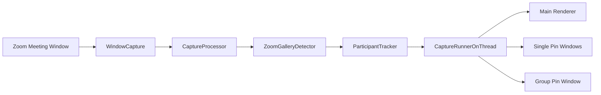

# Architecture

The app is organized around capture, detection, tracking, rendering, and pin windows.

## Modules

- `windowCaptureHandler.py` captures the selected Zoom window with Win32/GDI and recreates capture resources when the window size changes.
- `participant_detection.py` detects participant rectangles with projection and edge-based passes instead of fixed coordinates.
- `participant_tracking.py` assigns stable IDs using overlap, position, size, and visual descriptors.
- `CaptureProcessor.py` coordinates capture, detection, tracking, and debug overlays.
- `captureRunnerOnThread.py` runs one bounded 30 FPS capture loop and exposes immutable snapshots to the Tk renderers.
- `WindowRenderer.py` displays the combined gallery and maps clicks back to live tile metadata.
- `WindowRendererPreview.py` displays one pinned participant window.
- `WindowRendererGroupPreview.py` displays multiple pinned participants.
- `image_utils.py` contains shared image sizing, Tk conversion, blank-frame, composite, and cell-mapping helpers.

## Detection

Detection is dynamic per frame. The detector estimates the Zoom background from border samples, builds a foreground mask, segments likely gallery rows and columns, and supplements that with edge contours. Candidates are filtered by size, aspect ratio, area, and overlap.

The result is a list of `ParticipantTile` objects with:

- source window key
- rectangle in the Zoom capture
- crop image
- confidence score
- visual descriptor

## Tracking

Tracking does not depend on a fixed list index. Each new frame is matched against current tracks using:

- rectangle overlap
- visual descriptor similarity
- center movement
- size similarity

This keeps pins stable when tiles move or resize. Tracks are retained briefly through detection failures so temporary layout changes do not immediately discard pinned participants.

## Performance

The capture loop targets 30 FPS and keeps frame queues bounded to avoid memory growth. It logs measured capture FPS every few seconds so performance can be verified while the app is running.
