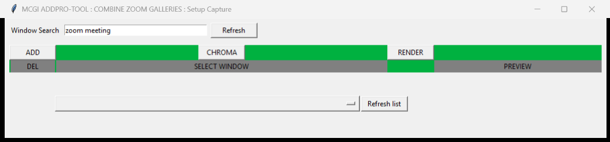
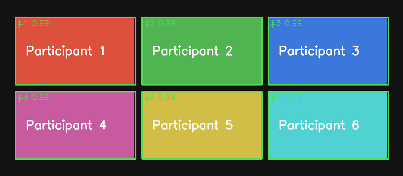
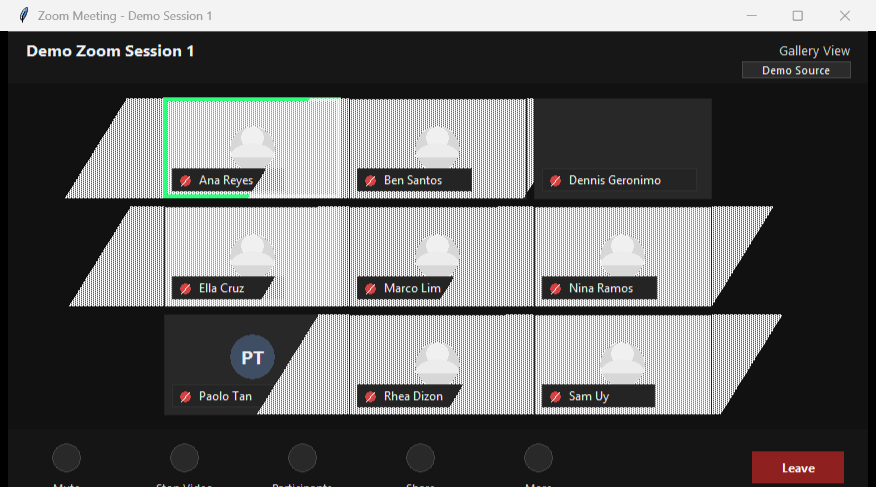

# Screenshots

This page collects the screenshots and visual references used by the documentation.

## Setup capture window

The setup window is where one or more Zoom App Gallery View sessions are selected. Use **ADD** to create another capture row when another Zoom session should be merged into the combined gallery.

## Detection debug overlay

The detection debug overlay shows the participant rectangles detected in a Zoom Gallery View frame. Use it to verify that the detector is finding the expected tiles before relying on pin windows.

## Live demo source

The live demo opens synthetic Zoom-like Gallery View windows that can be selected by the normal capture setup screen.

## Release screenshot checklist

The following screenshots should be refreshed from a real or test Zoom setup before a public release:

- `docs/images/merged-gallery-multi-session.png`: the merged gallery window showing participants from at least two Zoom sessions.
- `docs/images/single-pin-window.png`: one pinned participant window.
- `docs/images/group-pin-window.png`: a group pin window with multiple selected participants.

Redact participant names or use a test meeting when screenshots may expose private information.
